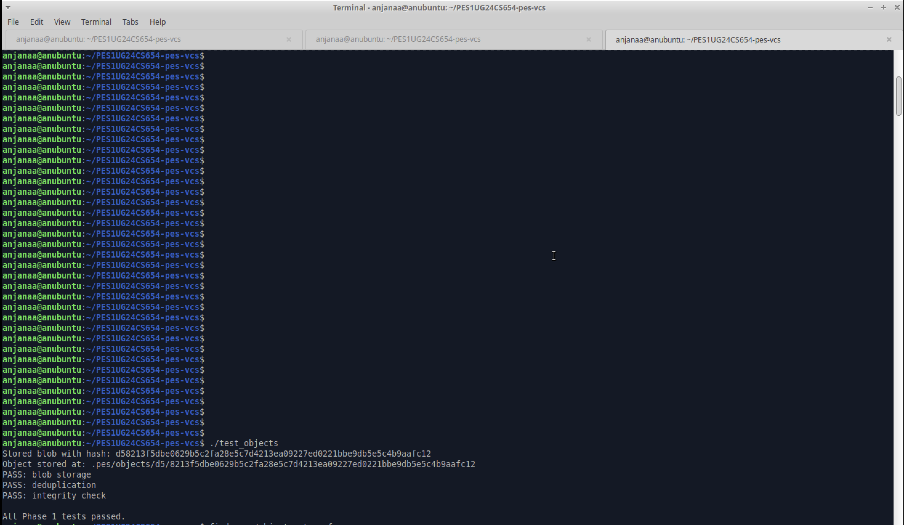
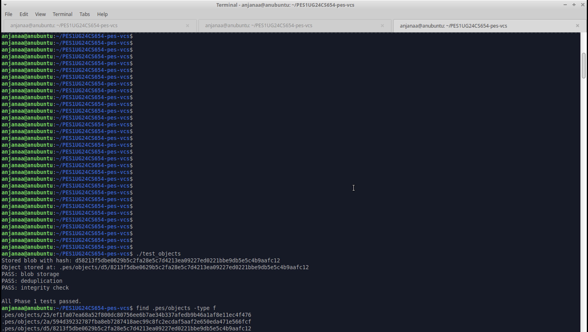
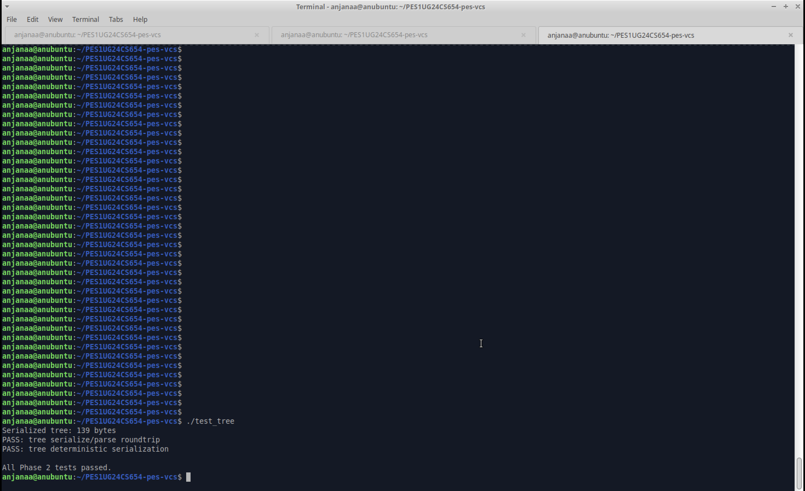
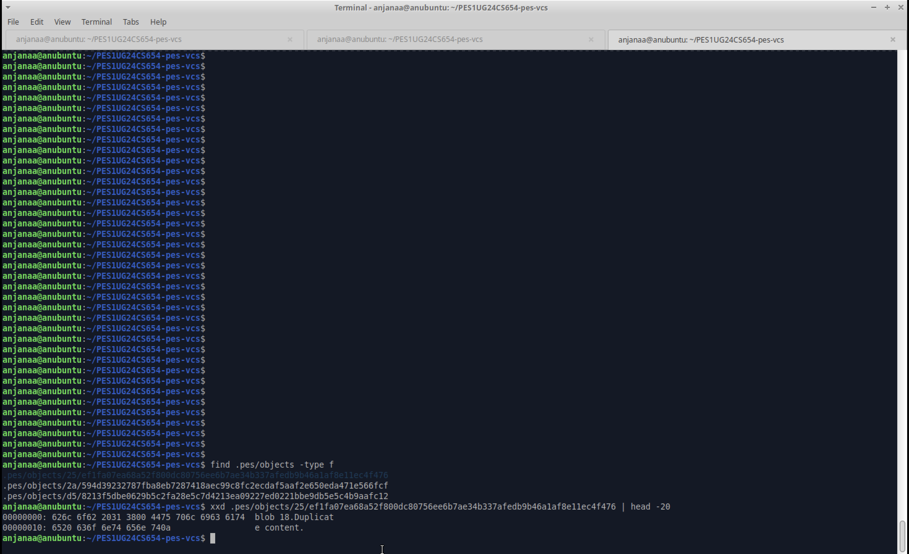
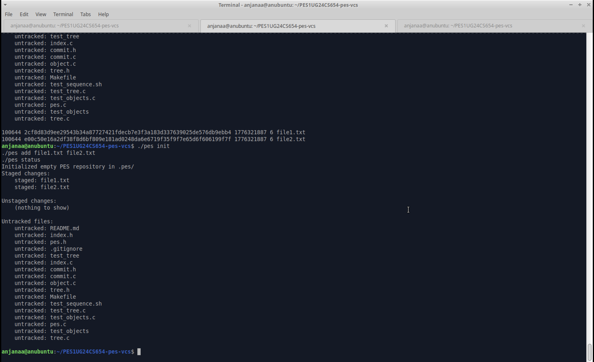
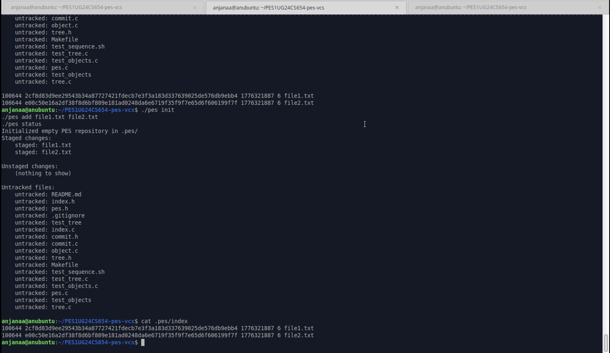
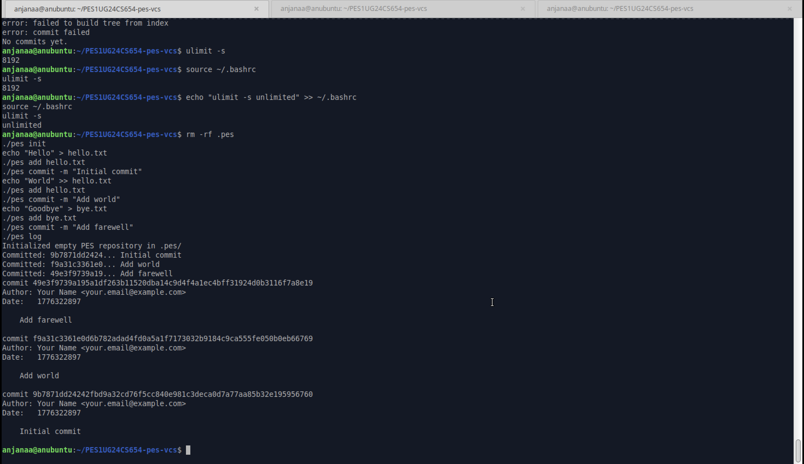
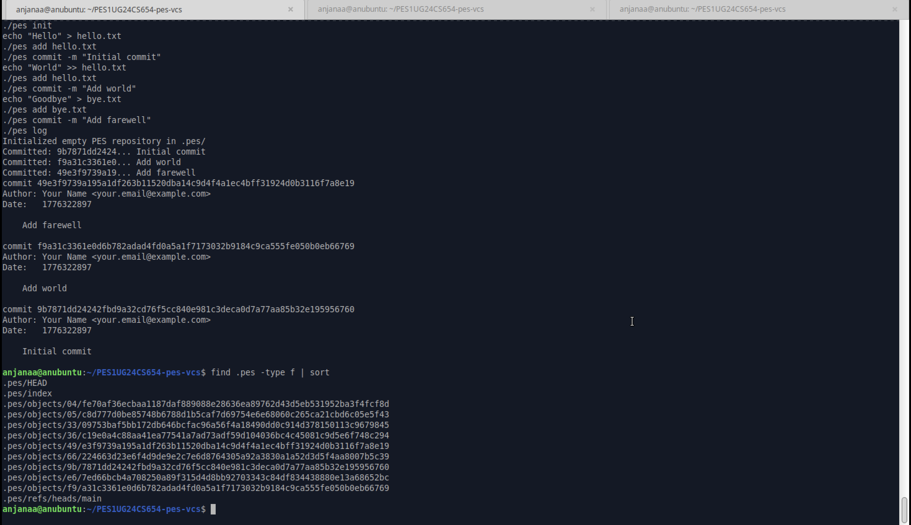
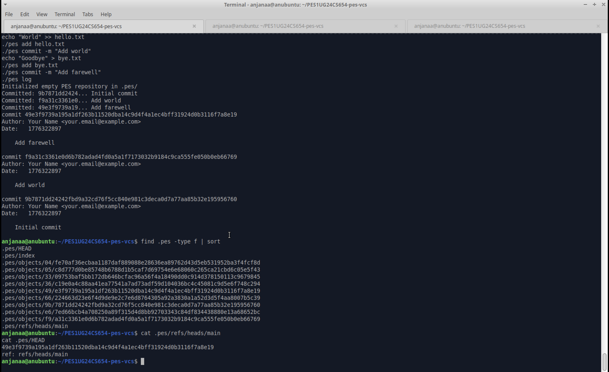
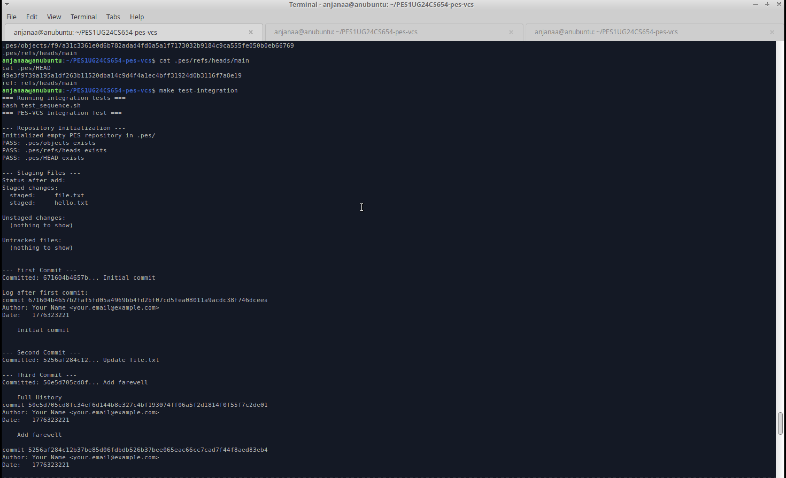

# PES-VCS Lab Report

## Student Details
- **Name:** Anjanaa Vijaysankar
- **SRN:** PES1UG24CS654
- **Repository Link:** https://github.com/anv10/PES1UG24CS654-pes-vcs

---

# Phase 1: Object Storage

## Implementation Overview
Implemented `object_write` and `object_read` in `object.c` to build a content-addressable object store modelled after Git's internal storage system.

## Key Concepts
- **Content-addressable storage:** Every object is named by the SHA-256 hash of its contents. Identical content always produces the same hash and is stored only once (deduplication).
- **Directory sharding:** Objects are stored under `.pes/objects/XX/YYY...` where `XX` is the first two hex characters of the hash, avoiding large flat directories.
- **Atomic writes:** Objects are written to a `.tmp` file first, then renamed into place. This ensures no partial writes are ever visible.
- **Integrity verification:** `object_read` recomputes the SHA-256 of the stored data and compares it to the filename hash to detect corruption.

## Steps Performed
1. Installed dependencies: `sudo apt install gcc build-essential libssl-dev`
2. Implemented `object_write`: prepends type header (`"blob/tree/commit <size>\0"`), computes SHA-256, shards into subdirectory, writes atomically via temp+rename.
3. Implemented `object_read`: reads file, parses header, verifies hash integrity, returns data portion.
4. Built and ran `./test_objects` — all tests passed.
5. Verified sharded directory structure with `find .pes/objects -type f`.

## Screenshots
### Screenshot 1A — Object Test Output


### Screenshot 1B — Object Store Structure


## Observations
- Same content written twice produces the same hash and is stored only once, confirming deduplication works correctly.
- The sharded `XX/YYY` structure keeps directory sizes manageable at scale.
- Integrity checking successfully detects any corruption by recomputing the hash on read.

---

# Phase 2: Tree Objects

## Implementation Overview
Implemented `tree_parse`, `tree_serialize`, and `tree_from_index` in `tree.c` to represent directory snapshots as binary tree objects.

## Key Concepts
- **Tree binary format:** Each entry is stored as `"<mode-octal> <name>\0<32-byte-binary-hash>"` — mode and name as ASCII, hash as raw bytes with no separator between entries.
- **Deterministic serialization:** Entries must be sorted by name before serialization so that identical directory contents always produce the same hash regardless of insertion order.
- **File modes:** `100644` = regular file, `100755` = executable, `040000` = directory (subtree).
- **Recursive structure:** Trees can point to other trees, representing nested directories.

## Steps Performed
1. Implemented `tree_parse`: safely finds the space, null byte, and 32-byte hash for each entry using `memchr`.
2. Implemented `tree_serialize`: sorts entries by name using `qsort`, then writes each entry in binary format.
3. Implemented `tree_from_index`: loads the index, builds a `Tree` struct from staged entries, serializes and writes to object store.
4. Heap-allocated the `Index` struct inside `tree_from_index` to avoid stack overflow (Index is ~5.7MB on stack).
5. Built and ran `./test_tree` — all tests passed.

## Screenshots
### Screenshot 2A — Tree Test Output


### Screenshot 2B — Raw Tree Object (xxd)


## Observations
- Serialize → parse roundtrip preserves all entry fields correctly.
- Sorting by name ensures deterministic hashing: the same set of files always produces the same tree hash.
- The binary format is compact — no wasted bytes between entries.

---

# Phase 3: Index (Staging Area)

## Implementation Overview
Implemented `index_load`, `index_save`, and `index_add` in `index.c` to manage the staging area — the preparation zone between the working directory and a commit.

## Key Concepts
- **Index file format:** A human-readable text file at `.pes/index`, one entry per line: `<mode_octal> <hex-hash> <mtime> <size> <path>`.
- **Atomic writes:** `index_save` writes to `.pes/index.tmp`, calls `fsync()`, then renames to `.pes/index` — ensuring no partial index is ever visible.
- **Change detection:** `index_status` compares `mtime` and `size` from the index against the live filesystem via `stat()` to detect unstaged modifications without re-hashing.
- **Stack overflow mitigation:** The `Index` struct with 10,000 entries is ~5.7MB. Stack limit raised with `ulimit -s unlimited` and heap allocation used where needed.

## Steps Performed
1. Implemented `index_load`: opens `.pes/index`, parses each line with `sscanf`, handles missing file gracefully.
2. Implemented `index_save`: sorts entries by path, writes to temp file, fsyncs, renames atomically.
3. Implemented `index_add`: reads file, writes blob to object store, updates or inserts index entry with current `mtime` and `size`.
4. Fixed stack overflow by running `ulimit -s unlimited` and adding it to `~/.bashrc`.
5. Tested full sequence: `pes init` → `pes add` → `pes status`.

## Screenshots
### Screenshot 3A — pes init + add + status


### Screenshot 3B — Index File Contents


## Observations
- The index correctly shows staged files immediately after `pes add`.
- Unstaged changes section correctly shows nothing when files haven't been modified since staging.
- `cat .pes/index` shows the human-readable text format with mode, hash, mtime, size, and path.

---

# Phase 4: Commits and History

## Implementation Overview
Implemented `commit_create` in `commit.c` to tie together trees, blobs, and metadata into a commit object, and to update the branch reference atomically.

## Key Concepts
- **Commit object format:** Plain text with fields `tree`, optional `parent`, `author`, `committer`, blank line, then message.
- **Parent chain:** Each commit points to its parent via hash, forming a linked list of history traversable with `commit_walk`.
- **Atomic pointer update:** `head_update` writes the new commit hash to a `.tmp` file and renames it — the branch pointer moves in a single atomic operation.
- **Symbolic refs:** `HEAD` contains `ref: refs/heads/main`, which points to the branch file containing the actual commit hash.

## Steps Performed
1. Implemented `commit_create`: calls `tree_from_index`, reads parent from HEAD, fills `Commit` struct, serializes, writes commit object, updates HEAD.
2. Verified `head_read` correctly follows `HEAD` → branch file → commit hash.
3. Verified `head_update` atomically updates the branch ref via temp+rename.
4. Tested three-commit sequence and verified `pes log` output.
5. Ran full integration test (`make test-integration`) — all tests passed, 10 objects created.

## Screenshots
### Screenshot 4A — Commit Log


### Screenshot 4B — Object Store Growth


### Screenshot 4C — HEAD and Branch References


## Observations
- Each commit correctly references the previous commit as parent, forming a complete history chain.
- Object count grows by 2–3 objects per commit (blob + tree + commit), with deduplication for unchanged files.
- `HEAD` → `refs/heads/main` → commit hash chain works correctly for both reading and updating.

---

# Final Integration Test

## Output


## Observations
- All integration test stages passed: repository initialization, staging, three commits, full history log, reference chain verification, and object store inspection.
- 10 objects were created across 3 commits: 3 blobs, 3 trees, 3 commits, plus 1 additional blob for the updated file.
- The reference chain correctly shows `HEAD` pointing to `refs/heads/main` which contains the latest commit hash.

---

# Analysis Questions

## Q5.1 — Implementing `pes checkout <branch>`

To implement `pes checkout <branch>`, the following changes are needed in `.pes/`:

**Files that must change:**
- `.pes/HEAD` must be updated to contain `ref: refs/heads/<branch>` pointing to the new branch.
- The working directory files must be updated to match the target branch's tree snapshot.

**Steps:**
1. Read the target branch file at `.pes/refs/heads/<branch>` to get its commit hash.
2. From that commit, read the tree hash.
3. Walk the tree recursively and write each blob's contents to the corresponding file path in the working directory.
4. Delete any tracked files that exist in the current branch's tree but not in the target branch's tree.
5. Update `.pes/HEAD` to point to the new branch.
6. Reload the index to reflect the new branch's file set.

**What makes this complex:**
The operation is complex because it must safely handle multiple failure scenarios atomically. If the checkout is interrupted midway, the working directory could be in an inconsistent state — some files from the old branch, some from the new. Additionally, if the user has modified tracked files that differ between branches, those changes could be silently overwritten. Git handles this by refusing to checkout if any tracked file would be overwritten, requiring the user to stash or commit first. Implementing this safety check requires comparing three states: the working directory, the current index, and the target branch's tree — all before making any changes.

---

## Q5.2 — Detecting Dirty Working Directory Conflicts

To detect whether a file would cause a conflict during branch switch, without re-reading the entire working directory, the following approach works using only the index and object store:

1. For each file in the **target branch's tree**, check if that path exists in the **current index**.
2. If it exists in the index, compare the index entry's `mtime` and `size` against the live file via `stat()`. If they differ, the file has been modified since staging — it is "dirty".
3. Additionally, compare the index entry's hash against the target branch's hash for that file. If they differ, the checkout would overwrite the modification.
4. If both conditions are true (file is dirty AND target branch has a different version), refuse the checkout with an error.

This approach is efficient because it avoids re-hashing files — `mtime` and `size` serve as a fast proxy for change detection, the same optimization used by `index_status`. Re-hashing is only needed if a file's mtime and size match but a deeper check is required (rare edge case).

---

## Q5.3 — Detached HEAD State

**What is detached HEAD:** When `HEAD` contains a raw commit hash directly (e.g., `a1b2c3...`) instead of a symbolic reference like `ref: refs/heads/main`, the repository is in detached HEAD state.

**What happens when you commit in this state:**
New commits are created normally — each commit correctly points to its parent. However, since no branch file is being updated, these commits are not reachable from any branch reference. They exist in the object store but are "floating" — not pointed to by any named ref.

**How to recover those commits:**
If the user knows the commit hash (e.g., from terminal history or `pes log` output before switching away), they can create a new branch pointing to that commit:
```
# Create a new branch at the detached commit hash
echo "<commit-hash>" > .pes/refs/heads/recovery-branch
# Then update HEAD to point to the new branch
echo "ref: refs/heads/recovery-branch" > .pes/HEAD
```
If the hash is unknown, the commits can still be found by scanning all objects in `.pes/objects/` and identifying commit objects not reachable from any branch — this is essentially what Git's `reflog` and `fsck` commands do.

---

## Q6.1 — Garbage Collection Algorithm

**Goal:** Find and delete all objects in `.pes/objects/` that are not reachable from any branch reference.

**Algorithm:**
1. **Collect all roots:** Read every file in `.pes/refs/heads/` to get all branch tip commit hashes.
2. **Mark reachable objects (BFS/DFS):** Use a hash set (e.g., a hash table keyed on ObjectID) to track visited hashes. For each root commit: mark the commit hash, read the commit to get its tree hash and parent hash, mark the tree, recursively walk the tree to mark all blob and subtree hashes, follow the parent pointer and repeat until no parent exists.
3. **Sweep unreachable objects:** Walk all files in `.pes/objects/XX/YYY...`, reconstruct each hash from its path, and check if it exists in the reachable set. If not, delete it.

**Data structure:** A hash set of `ObjectID` values (32-byte hashes) is ideal — O(1) lookup per object during the sweep phase.

**Estimate for 100,000 commits, 50 branches:**
Assuming an average of 10 objects per commit (blobs + trees + commit itself), there would be roughly 1,000,000 total objects in the store. The mark phase visits all reachable objects — in the worst case all 1,000,000 if nothing is garbage. The sweep phase also scans all 1,000,000 objects. Total: approximately 2,000,000 object accesses.

---

## Q6.2 — Race Condition Between GC and Concurrent Commit

**The race condition:**

Consider this sequence:
1. A commit operation begins. It writes a new blob object to `.pes/objects/` but has not yet written the tree or commit object.
2. GC starts its mark phase. It walks all branch refs and marks reachable objects — but the new blob is not yet referenced by any commit or tree, so it is **not marked**.
3. GC's sweep phase runs and **deletes the new blob** because it appears unreachable.
4. The commit operation continues, writes the tree (which references the now-deleted blob), writes the commit, and updates HEAD.
5. The repository is now corrupt — the commit references a blob that no longer exists.

**How Git avoids this:**
Git uses a **grace period** — objects newer than a certain age (default 2 weeks) are never deleted by GC, regardless of reachability. Since a commit operation completes in milliseconds to seconds, any object written recently is safe. GC only deletes objects that have been unreachable for longer than the grace period. Git also uses lock files to prevent concurrent GC runs, and the `pack-refs` and `gc.log` mechanisms to serialize dangerous operations.

---

# Conclusion

This lab provided hands-on implementation of the core internals of a version control system modelled after Git. By building PES-VCS from scratch in C, the following OS and filesystem concepts were applied directly: content-addressable storage using SHA-256, directory sharding for scalable object storage, atomic writes via temp-file-then-rename, integrity verification through hash recomputation, text-based file format design for the index, change detection using mtime and size metadata, symbolic reference chains for branch management, and linked commit history on disk. The analysis questions further deepened understanding of checkout safety, garbage collection algorithms, and concurrency hazards in filesystem operations.